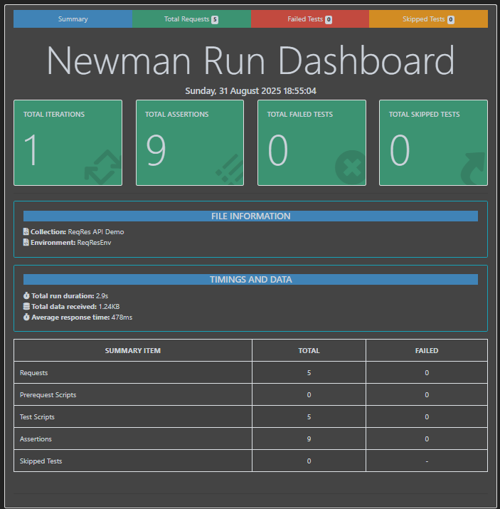

# API Testing with Postman & Newman 🚀

## 📌 Project Overview
This project demonstrates **API Testing** using:
- [Postman](https://www.postman.com/)
- [Newman](https://www.npmjs.com/package/newman)
- Public API: [ReqRes](https://reqres.in/)

The goal is to execute CRUD operations + Authentication with automated tests and reporting.

---

## 📂 Project Structure
```
api-testing-reqres-postman/
│── postman/
│   ├── ReqResCollection.postman_collection.json
│   ├── ReqResEnv.postman_environment.json
│   ├── screenshot-report.png   
│── README.md
│── API-Report.html
```

---

## ⚡ How to Run Tests

### 1️⃣ Run with Postman GUI
1.  Import `ReqResCollection.postman_collection.json` into Postman.
2.  Import `ReqResEnv.postman_environment.json`.
3.  Run the **Collection Runner** inside Postman.

---

### 2️⃣ Run with Newman (CLI)
```bash
newman run postman/ReqResCollection.postman_collection.json -e postman/ReqResEnv.postman_environment.json
```

### 3️⃣ Run with Newman + HTML Report
```bash
newman run postman/ReqResCollection.postman_collection.json -e postman/ReqResEnv.postman_environment.json -r htmlextra --reporter-htmlextra-export API-Report.html
```

### ✅ Test Cases

*   `GET /users?page=2` → verify `200 OK` + response contains data array.

*   `POST /users` → verify `201 Created` + response contains `id`.

*   `PUT /users/2` → verify `200 OK` + response contains `updatedAt`.

*   `DELETE /users/2` → verify `204 No Content`.

*   `POST /login` → verify `200 OK` + response contains `token`.

## 📊 Sample Report
Newman HTML dashboard example after running the collection:




### 🔮 Next Steps
*   Add Schema Validation.
*   Add Advanced Authentication (Token / OAuth).
*   Connect API tests with a Database (SQL queries).
*   Integrate with GitHub Actions CI/CD.
*   Extend project using RestAssured (Java) for professional-level automation.